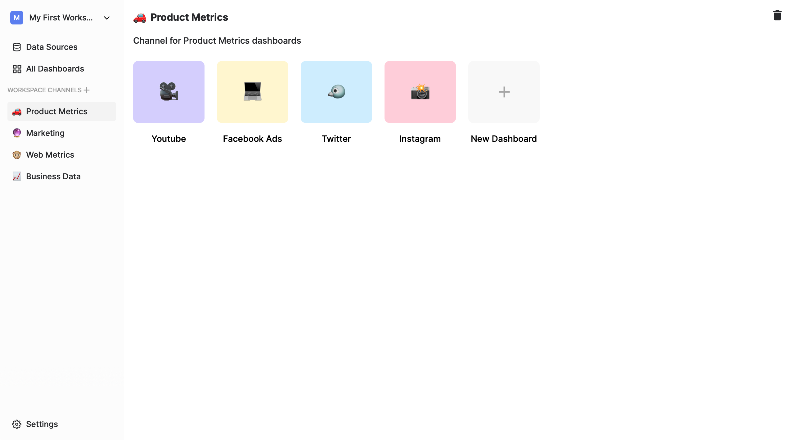
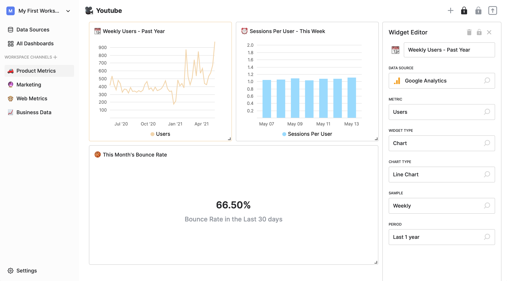
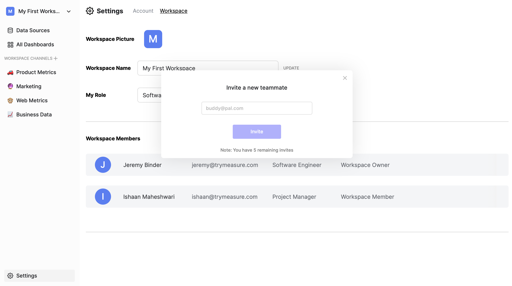

    

# Measure (Demo)

Business intelligence should be more accessible to non-technical users. Measure is a collaborative no-code dashboard building tool that allows users of any skill-level to connect 3rd-party data sources like Stripe & Google Analytics to their workspace, and gain insights from their data in minutes.
 
 

## Highlights

### Organize your workspace with channels and dashboards

 

### Create and edit data visualizations in the dashboard view

 

### Invite friends or co-workers to collaborate in your workspace

 

• Built with React, SCSS, and Visx

• Now defunct, originally connected to serverless backend written in Node.js and Python

• Live at https://measure.jeremybinder.dev
